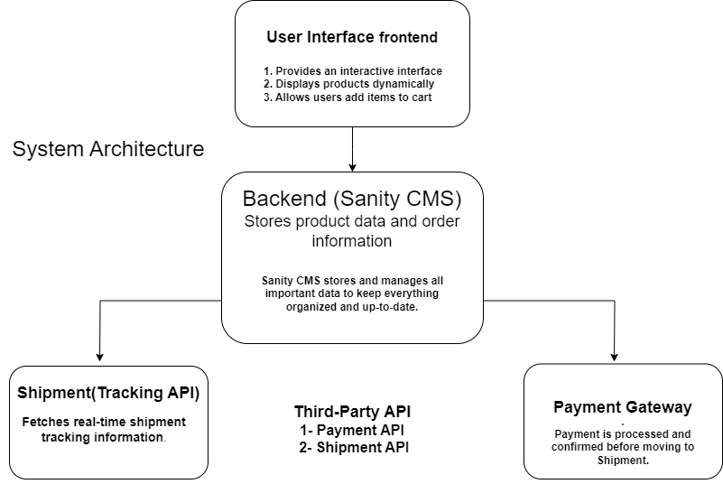

# Marketplace Technical Foundation - InteriorDesigningWebsite

This marketplace is designed to offer a wide range of high-quality interior design products, including furniture, décor, and lighting. The goal is to provide a user-friendly platform where customers can easily browse, compare, and purchase products to enhance their homes, with various styles and price points.

---

## Overview

### General E-commerce

This document covers the system architecture, key workflows, and technical requirements for building the marketplace platform. It includes details for Day 1 (foundation) and Day 2 (advancement), along with API specifications and workflows for smooth project execution.

---
## DAY 2: PLANNING THE TECHNICAL FOUNDATION

### 1. System Architecture Overview

The Frontend communicates with the Backend API to browse products, manage the cart, and place orders. Sanity CMS serves as the backend, storing product data for easy access. Additionally, the Backend integrates with third-party APIs for payment processing and order tracking.

### Key Workflows

1. **Add Product to Cart**: The user selects a product, and the frontend updates the cart through the Backend API.
2. **Place Order**: The user checks out, and the frontend collects payment details, which the backend processes.
3. **Order Confirmation**: The frontend shows an order confirmation after the payment is successful.
4. **Track Order**: The user asks to track their order, and the frontend gets the tracking info from the Backend API.
5. **View Tracking**: The backend gets tracking info from a third-party service, and the frontend shows it to the user.

---
"# Marketplace-Builder-Hackathon-2025-E-Commerce-Website" 
